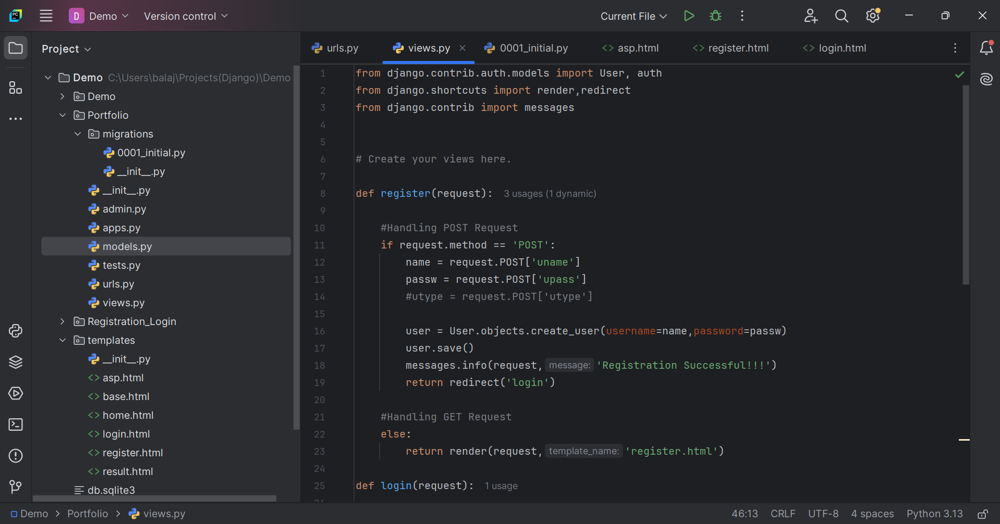
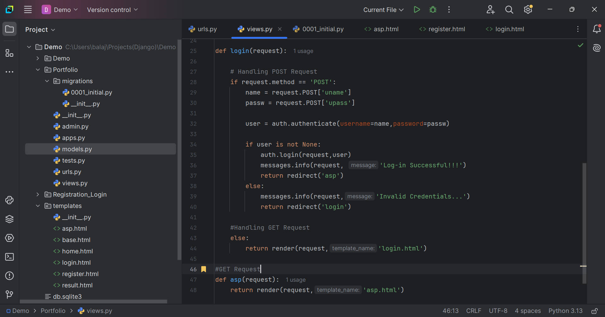
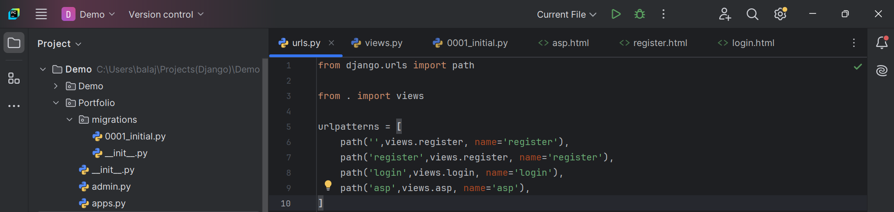

# Python-Django-
User Registration and Login System

This repository contains a simple User Registration and Login System built as part of a task for my MCA internship selection process at APS Technology.

Features :-

User Registration: Securely register new users using the Django framework.

User Login: Authenticate users with GET and POST requests.

Database Integration: User data is stored and managed using MySQL Workbench.

Tech Stack :-

Backend: Django (Python)

Database: MySQL Workbench

GET and POST :-

Page Mapping are Handled with the help of GET Request

Data Storing and Retriving process are Handled with the help of POST Request

Registration Page:-

Registration Page(Code) : Registration Page Mapping is handled using GET Request and data are stored in DB with the help of POST Request.

Login Page:-

Login Page(Code) : Login Page Mapping is handled using GET Request and data are retrived from DB with the help of POST Request.

Login-Successful Page:-

URL Mapping Code:-

DB Connection(MySQL WorkBench) Code:-

